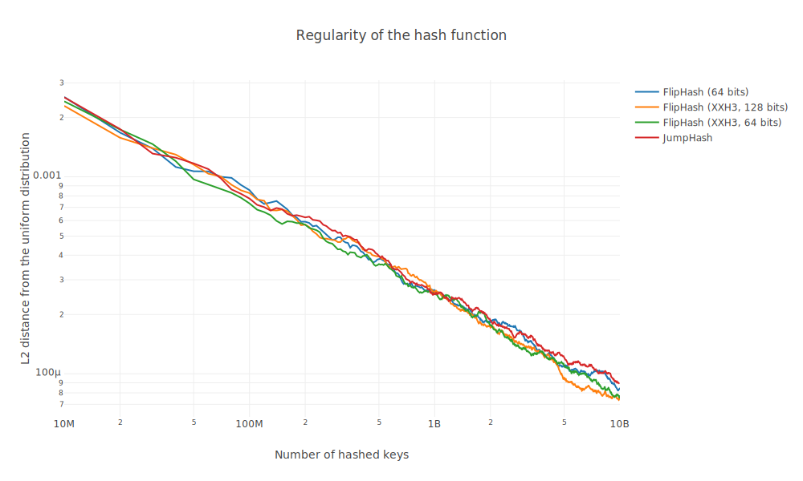
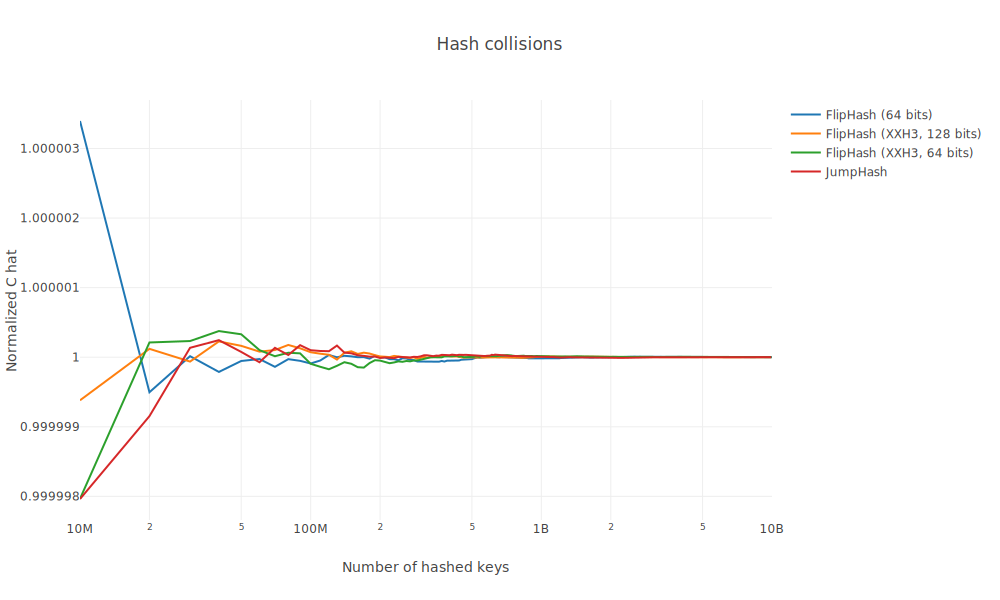
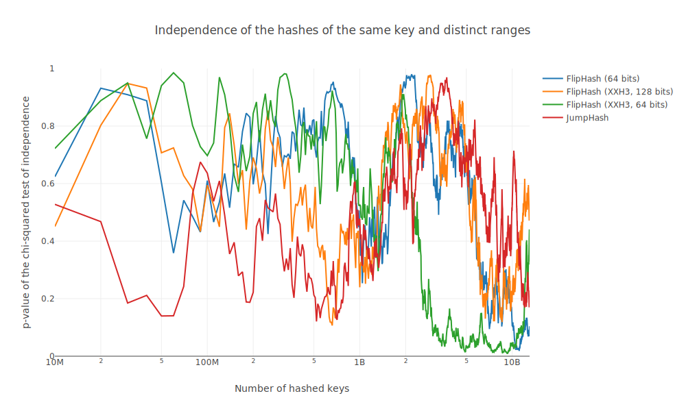
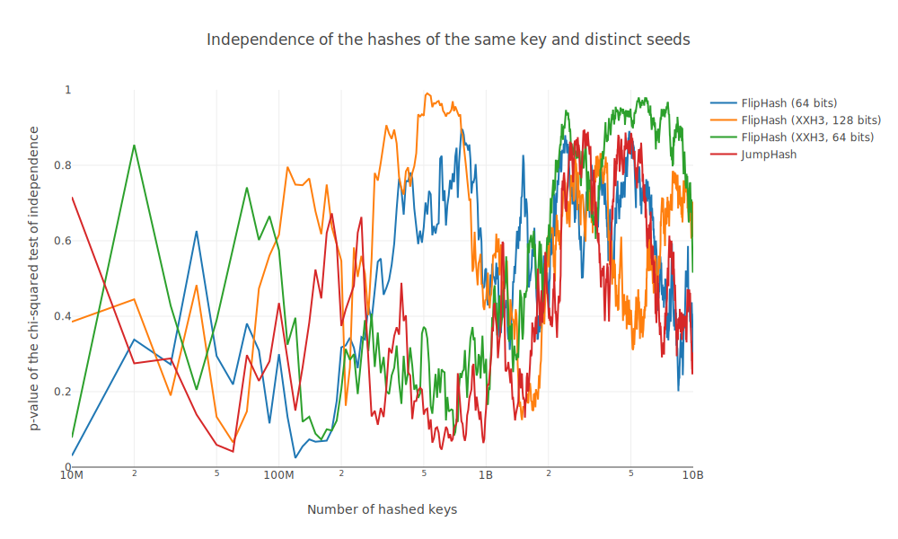

# Performance benchmarks

```
cargo bench
# Output report at target/criterion/report/index.html
```

## Results

On an Intel Xeon Platinum 8375C CPU @ 2.9GHz.

| Range           | FlipHash | JumpHash |
| --------------- | -------- | -------- |
| `..=10`         | 5.9 ns   | 8.2 ns   |
| `..=1000`       | 4.7 ns   | 25 ns    |
| `..=1000000`    | 5.5 ns   | 45 ns    |
| `..=1000000000` | 6.4 ns   | 69 ns    |

# Behavioral benchmarks

```
cargo run -r -- help
# Output in ./results/
```

## Results

### Regularity

`cargo run -r -- regularity --num-resources 100 --input-size-bytes 64`



### Hash collisions

`cargo run -r -- collisions --num-resources 100 --input-size-bytes 64`



### Mutual independence across ranges

`cargo run -r -- independence-across-ranges --num-resources 7 --num-resources 17 --input-size-bytes 64`



### Mutual independence across seeds

`cargo run -r -- independence-across-seeds --num-resources 100 --num-seeds 2 --input-size-bytes 64`


